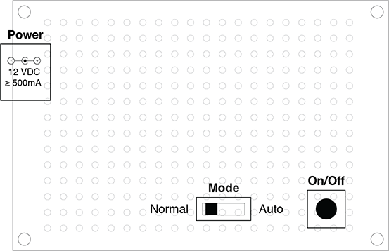

# Simple Universal Lighting Timer User Manual

## Mode switch
- When switched to the position closest to the power input, the device is in Normal Mode.
- When switched to the position furthest from the power input, the device is in Auto Mode.

## Normal Mode
- Lights turn on and off manually by pressing the button.
- No timers are enabled.

## Auto Mode
- Lights turn on and off manually by pressing the button, and are also controlled by timers.
- Press the button to turn on the lights. This will be the time of day that the lights always turn on every day from here on out.
- By default the lights will remain on for 6 hours before they turn off automatically.
- Manually turn the lights off early by pressing the button. This will update the timers such that the lights always turn off at this time of day. 
- Note, if the lights are turned off within the first 30 minutes of turning on, no changes to timers will be made.
- Update the timers at any time by turning the lights on or off manually.

## To reset to default values
1. Turn the lights off if they are on by pressing the button.
1. If not already, flip the mode switch to Auto Mode.
1. Flip the mode switch to Normal Mode briefly, and then back to Auto Mode.
1. Default settings have been restored. Follow the procedures in the previous sections to configure.

## Notes
- It is recommended to turn off lights by pressing the button before switching between Normal Mode and Auto Mode.
- In the event of power loss, the backup power will be able to keep the timers running for a couple hours, even though the lights cannot turn on. This means that the device does not need to be reconfigured after a brief power outage, or if the device is relocated.
